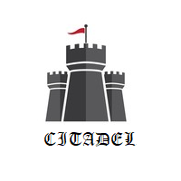

# The Citadel Project

We do believe in:

* **Automated Tests.** Each application function is covered by set automated tests (see Test Pyramid). Code changes that
  lacks of tests shall not pass code review.
* **Clean Code.** In terms
  of [Robert C. Martin - Clean Code: A Handbook of Agile Software Craftsmanship](https://www.amazon.com/Clean-Code-Handbook-Software-Craftsmanship/dp/0132350882)
  .
* **Continuous Integration.** There is no chance to break already working function as **each** incoming change verified
  **automatically**. Breaking changes shall not pass.

## Description

This project is an opinionated view on a way of developing Java-based applications leveraging **the power of automated
tests** . Though, concepts are not Java-specific, tools and showcases are, so have to have this caveat.

We are putting automated tests at the forefront. We believe that treating tests as a must gives us not only obvious
benefits like improved maintainability and decreased support costs, but forces a project to be in an extremely healthy
and competitive state - see [Benefits](#benefits) section.

An application itself is _to be formulted_ - [documentation](doc/index.md). 

## Goals

This project has two goals:

* **Share our ideas.** _Talk is cheap. Show me the code._ - L.Torvalds. We believe that for a software engineer showing
  the code is the easiest and quickest way to get the message.
* **Proof our ideas.** We want to have a handbook containing set of **working** examples demonstrating how to
  incorporate CI and all layers of the Test Pyramid dealing with one or another technology.

## Benefits

* _Application is 'evergreen'._ There is no chance to break already working function as each incoming change verified
  automatically.
* _Anyone can contribute safely._ There is no chance to break... Well, you get it. As an outcome - friendly and
  comfortable working environment assuming no overtimes and late night stays.
* _Anyone can contribute quickly._ All you need is access to the repository, afterwards you can get running application
  instance by running a single command. All functions are documented in form of automated functional tests and, what is
  even more important, all configurations/pre-sets required to reach a function are already in place (it has to be to
  fulfill tests on CI) - so **any function** available for debug/investigation **immediately**. The same is valid for
  application configuration settings and external dependencies.
* _Refactoring of any complexity is encouraged and welcome._ No chance to break anything, right? You want to clean up
  some code? New feature begs for re-design first? Or you'd like just raise a version of a library and get the latest
  perks? Just fire away - you don't even need to validate your changes locally (not speaking of 'full regression run')
  before creating a pull-request.
* _Experimenting is safe and encouraged._ Pretty much connected to the previous one. Want to replace your ORM? Database
  vendor? Try the latest Java version? Just make a change and get feedback on how many functions are failed. Oops, it
  seems you just have completed a PoC task :)

## Test Pyramid

TBD - describe on high-level the 4 levels of automated tests, difference between them, touch contract tests.

### Unit Tests

TBD

### Integrated Unit Tests

TBD

### Functional Tests

TBD

### UI Tests

TBD

## Based on

* [Robert C. Martin - The Principles of OOD (SOLID and more)](http://www.butunclebob.com/ArticleS.UncleBob.PrinciplesOfOod)
* [Robert C. Martin - Clean Code: A Handbook of Agile Software Craftsmanship](https://www.amazon.com/Clean-Code-Handbook-Software-Craftsmanship/dp/0132350882)
* [Kent Beck - Test Driven Development: By Example](https://www.amazon.com/Test-Driven-Development-Kent-Beck/dp/0321146530)
* [Steve Freeman - Growing Object-Oriented Software, Guided by Tests](https://www.amazon.com/Growing-Object-Oriented-Software-Guided-Tests/dp/0321503627) 
