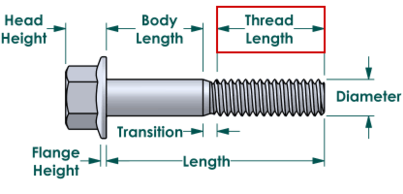
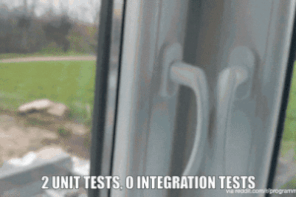
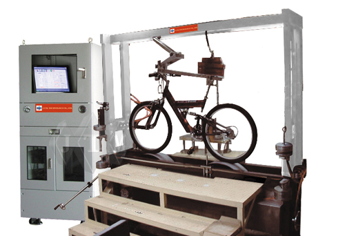
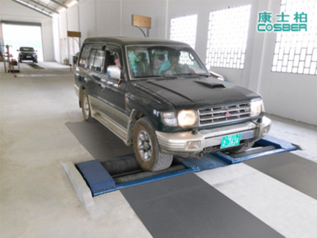

# Automated Tests Pyramid

* We hold the view that each software system has to be guarded by 4 layers of automated tests (on what boundaries of a
  software system are, refer to [Contract Tests](#contract-tests) section):

                                                                  ..
                                                                ..UI..
                                                              ..........
                                                            ....System....
                                                          ..................
                                                        ....Integrated Unit...
                                                      ..........................
                                                    .............Unit.............

## Why Pyramid

It's a well known and adopted metaphor. It is expected a lot of [unit tests](#unit-tests) to be written, notably
less [integrated unit tests](#integrated-unit-tests), much less [system tests](#system-tests) and as few as
possible [UI tests](#ui-tests). Try to visualize these amounts starting from the biggest one at the bottom, and you end
up with something like a triangle or pyramid. Check out the https://martinfowler.com/bliki/TestPyramid.html for more
expanded description.

## Layers Briefly

* [Unit Tests](../../src/test) - code-level (white-box) tests focused on a **software unit** behavior, all dependencies
  are isolated.
* [Integrated Unit Tests](../../src/test-integrated-unit) - code-level (white-box) tests focused on behavior of several
  **software units in integration**, internal/lightweight dependencies are real objects, external/heavyweight
  dependencies are stubbed.
* [System Tests](../../src/test-system) - system-level (black-box) tests focused on a software function, require
  **running system** instance, interaction with system carried out by machine interface (REST/HTTP, etc.).
* [UI Tests](../../src/test-ui-web) - system-level (black-box) tests focused on a software **function availability for
  end-user**, require running system instance, interaction with system carried out by User Interface.

## Layers in Details

### Unit Tests

For us a unit test is a so-called Fowler's solitary unit test. This kind usually the most adopted and well-known, so
instead of trying to provide our own descriptions let's stick to https://martinfowler.com/bliki/UnitTest.html. Very
briefly - this is a white-box testing dealing with the smallest pieces of software with all possible dependencies
isolated.

At the same time, we stress the importance of unit tests in first order as a **design tool**, with a positive side
effect of being a software vise[^1]. Written code **must be** unit tested - it forces a developer to touch and exercise
their code right at the time of writing, and any code smell usually turns into an obstacle during unit testing, so a
developer is **forced to enhance code** design.

Besides that, this is the very first line of our defence - yep, there are a lot of mocking and there is always a feeling
that unit test is just a refined environment for our code, but this is the best place to spot code-level bugs.

_**Rationale** to have this layer in place is to **enforce better code design** and to **keep our code units precise and
correct** and is best described by following pictures:_

Test code looks like

    class CartServiceTest {
    
      @InjectMocks CartService testee = new CartService();
      @Mock StockService stockService;

      @Test
      public void discountAppliedToTotal() {
        // given
        Item product = mock(Item.class);
        when(item1.getPrice()).thenReturn(70);

        Item accessory = mock(Item.class);
        when(item2.getPrice()).thenReturn(30);

        when(stockService.getItemQuantity(any(Item.class))).thenReturn(1);

        testee.addToCart(product);
        testee.addToCart(accessory);

        // when
        testee.applyDiscount("test-discount-code-20-perc");

        // then
        assertThat(cartService.getTotal(), equalTo(80));
      }
    }

### Integrated Unit Tests

This is not a something new, but this kind might be known under different names - Integration Tests, Component Tests,
Context Test, [Sociable Unit Tests](https://martinfowler.com/bliki/UnitTest.html), etc. At the same time any of these
terms is really overloaded - Integration Tests for many of us means integration with external services or let say
testing microservices in integration. The situation is pretty much same with other terms.

This type of tests just one level above the Unit Tests with the only difference - instead of mocked dependencies at this
level we use real objects - i.e. we test a software unit in integration with other units (that's why 'Integrated Unit'
term). This is still white-box testing and it corresponds to Fowler's
[Sociable Unit Tests](https://martinfowler.com/bliki/UnitTest.html).

Important notice here is the approach to cope with external integrations - databases, message brokers, email services,
weather services, google maps, etc. Basic flow is to have [Test Double](https://martinfowler.com/bliki/TestDouble.html)
for each such dependency: instead of MSSQL/Oracle/MySql/Postgre/... RBDMS we usually use lightweight in-memory solutions
([H2](https://www.h2database.com/)), for email services things like [smtp4dev](https://github.com/rnwood/smtp4dev) or
[maildev](https://github.com/maildev/maildev), less common or proprietary services are going to have Stubbed
implementation developed by ourselves with help of such tools as [Wiremock](https://wiremock.org/).

_**Rationale** to have this layer in place is **to make sure our code units integrated into components are functional**
and is best described by following pictures:_

Test code looks like

    class CartServiceIntegratedTest {

    @Autowired CartService testee;
    @Autowired StockService stockService;
    @Autowired ItemFactory itemFactory;

      @Test
      public void discountAppliedToTotal() {
        // given
        Item product = itemFactory.withName("product").withPrice(70);
        Item accessory = itemFactory.withName("accessory").withPrice(30);

        int quantity = 100;
        stockService.putItems(product, quantity);
        stockService.putItems(accessory, quantity);

        // when
        cartService.addToCart(product);
        cartService.addToCart(accessory);

        // and
        cartService.applyDiscount("test-discount-code-20-perc");

        // then
        assertThat(cartService.getTotal(), equalTo(80));
      }
    }

### System Tests

This layer also might be known under different names: Acceptance Tests, Application Tests, Functional Test, End-to-End
Tests (the same as E2E), Scenario Tests... The key feature of such kind of tests is that they require deployed and
**running system** (that's why we settled on the System Tests term).

In contrast to Unit and Integrated Unit Tests this is a **black-box testing**. Interaction with a system is carried out
by **machine interface** (and this is important!), not by user interface. It might require additional development
effort (not significant, though) to provide this interface (basic approach is REST via HTTP), but in comparison to costs
of maintenance required by tests based on user interface this effort is negligible.

This level of testing gives us the most level of confidence - we deal with actually running system, but for this exact
reason this layer is not cheap and not so easy to maintain, so amount of such tests has to be kept reasonably small.

_**Rationale** to have this layer in place is **to make sure our system is functioning correctly** and is best described
by following pictures:_

Test code looks like

    class CartWithDiscountSpec {
    
      System system;

      // each interaction with a system is carried out via machine interface;
      // test focus is system functionality, few steps, many assertions
      //
      // system.authenitcate("james_bond", "secret007") under the hood:
      // POST https://system.test.server.com/rest/authenticate {"username": "james_bond", "password": "secret007"}
      //
      // system.addToCart('product') under the hood:
      // POST https://system.test.server.com/cart/items {"item": "product"}
      @Test
      def 'User discount applied to total price in cart'() {
        given: 'user authenticated'
        system.authenitcate("james_bond", "secret007")

        when: 'uaser adds items to cart'
        system.addToCart('product')
        system.addToCart('accessory')

        then: 'total price calculated'
        system.getCart().getTotalPrice == 100 //assertion

        when: 'user applies dicsount'
        system.applyUserDiscount('test-discount-code-20-perc')

        then: 'discount applied successfully'
        system.getCart().getAppliedDiscount == ['test-discount-code-20-perc'] //assertion

        and: 'discount applied to total price'
        system.getCart().getTotalPrice == 80  //assertion
      }
    }

### UI Tests

This layer is pretty much similar to the [System Tests](#system-tests) in sense that it's a **black-box testing** either
with deployed and **running system** required, but interaction with a system is carried out by **user interface**.

It is very important to understand that purpose of these tests is very different from the purpose of System Tests. UI
Tests are necessary to assure that our system functions are usable by end user. Again - functions correctness covered by
the three previous layers! This type of tests is most expensive - interaction with a system via user interface is not
somewhat easy for machines, and costs to maintain tests caused by UI changes are really high.

Unfortunately, there is a common situation when lacking [System Tests](#system-tests), but having UI Tests peoples tries
to perform functionality correctness assurance at this layer. As a result they have got a test suite which from one side
has insufficient coverage (due to for machine it's complicated to interact via UI), from another side is unstable and
hardly maintainable.

This layer still has to present for the reason that overall purpose of any software is to deliver service to an end
user, but it has to be limited to assertion of functions availability (and should not fall into correctness validation)
and amount of these tests must be kept as small as possible.

One more thing to mention here is that having several user interfaces (Web, Mobile, Smartwatch, Something Else), it is
supposed to have a suite for each of them, so that for the moment we have the only
[UI Web Tests](../../src/test-ui-web), but potentially we should expect UI Mobile Tests, UI Smartwatch Tests, etc.

_**Rationale** to have this layer in place is **to make sure our system is usable by a human** and is best described by
following picture:_

Test code looks like

    @Stepwise
    class PurchaseWithDiscountSpec {
    
      System system;

      // each interaction with a system is carried out via user interface;
      // test focus is user's ability to pass end to end scenario, many steps (1 @Test == 1 step, @Stepwise - each
      // subsequent step based on the previous one), few assertions  
      //
      // system.authenitcate("james_bond", "secret007") under the hood:
      // open(https://system.test.server.com/login);
      // usernameField.setValue("james_bond");
      // passwordField.setValue("secret007");
      // locateElementById("loginButton").click();
      @Test
      def 'User authenticates'() {
          when: 'user authenticated'
          system.authenitcate("james_bond", "secret007")

          then: 'no failure expected'
          //no failure        
      }
      
      @Test
      def 'Adds items to cart'() {
          when: 'uaser adds items to cart'
          system.addToCart('product')
          system.addToCart('accessory')

          then: 'correct total displayed'
          system.getCart().getTotalPrice == 100
      }

      @Test
      def 'Applies discount'() {
          when: 'user applies dicsount'
          system.applyUserDiscount('test-discount-code-20-perc')

          then: 'discount applied to total price'
          system.getCart().getTotalPrice == 80
      }
      @Test
      def 'Performs checkout'() {
          given: 'user proceeds to checkout'
          system.proceedToCheckout()
                  
          when: 'billing detailes filled'
          system.checkout.enterBillingDetail(CARD_NUMBER, VALID_THROUGH)

          and: 'purchace confirmed'
          system.checkout.confirm()

          then: 'purchace successfully completed'
          system.statusPage.getStatus == 'successfull'
      }
    }

## Contract Tests

It is important to understand that the 4 layers described above are relevant to a single software system. There is no
clear description of where boundaries of a software system lie - depending on nature of the pieces the software is
compound of even similarly looking deployment landscapes might be treated as either a single system utilizing database
and providing presentation and business logic services, or as three separate multifunctional systems with different
lifecycles and purposes, but interacting together to provide certain function.

When we speak about a software system we mean something close to such terms as a software component, microservice,
monolith application. Usually a software system is a software developed and maintained by a single vendor (team), all
pieces of this software are tightly interconnected in terms of deployment and lifecycle, each peace of a system usually
cannot act solely and does not provide complete business function by itself.

As an example let's consider an application consisting of three microservices (systems) - A, B and C. In this case we
expect to have three test pyramids (obviously, if a microservice lacks user interface, UI tests are not present either).
Important thing to notice that System Tests always require a system (microservice) under test to be deployed, but never
two other systems. So System Tests (and UI tests if applicable) for microservice A will be run against 'software system
A' which is A's executable, database, cache engine, message broker, etc. plus **stubbed B**, plus **stubbed C**.

An approach to close this gap - no automated tests against fully integrated application (deployed A + deployed B +
deployed C) - is to leverage [Contract Testing](https://pactflow.io/blog/what-is-contract-testing/).

[^1]:From Working Effectively with Legacy Code by Michael Feathers:

    Software Vise vise (n.). A clamping device, usually consisting of two jaws closed or opened by a screw or lever,
    used in carpentry or metalworking to hold a piece in position. The American Heritage Dictionary of the English
    Language, Fourth Edition.

    When we have tests that detect change, it is like having a vise around our code. The behavior of the code is fixed
    in place. When we make changes, we can know that we are changing only one piece of behavior at a time. In short,
    we’re in control of our work.